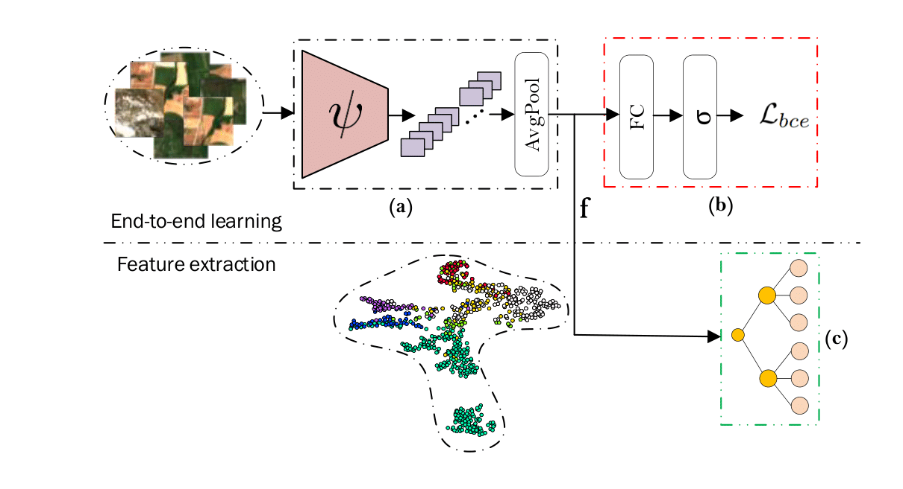

# RSMLC

This repository contains PyTorch implementation of the following paper: 
Stoimchev, M., Kocev, D., Džeroski. S., "Deep network architectures as feature extractors for multi-label classification of remote sensing images"

# Methodology



##  Table of Contents
- [The used methodology](#RSMLC)
    - [Installation](#installation)
    - [Train/Inference/Extraction](#training)
    - [Tree ensemble methods](#ensembles)
    - [Citing the paper](#citing)
    - [Reference](#reference)

##  Links to the used datasets
- [Datasets](#RSMLC)
    - [AID](https://github.com/Hua-YS/AID-Multilabel-Dataset)
    - [UCMercedLandUse](https://bigearth.eu/datasets)
    - [AnkaraHSI](https://bigearth.eu/datasets)
    - [MLRSNet](https://github.com/cugbrs/MLRSNet)
    - [DFC-15](https://github.com/Hua-YS/DFC15-Multilabel-Dataset)
    - [BigEarthNet](https://bigearth.net/)

## Dependencies

- Python3
- PyTorch
- Torchvision
- Numpy
- Albumentations 
- scikit-learn
- timm
- iterative-stratification
## Installation
1. First clone the repository
   ```
   git clone https://github.com/Marjan1111/RSMLC.git
   ``` 
2. Create the virtual environment via conda
    ```
    conda create -n tpa python=3.9
    ```
3. Activate the virtual environment.
    ```
    conda activate rsmlc
    ```
3. Install the dependencies.
   ```
   pip install -r requirements.txt
   ```
## Train/Inference/Extraction
To list the arguments, run the following command:
```
python main.py -h
```

### Example how to execute the training, inference and feature extraction for the UCM dataset

```
python main.py \     
    --dataset UCM \         
    --mode True \      
    --n_epochs 100 \
    --batch_size 64 \ 
    --seed 42 \  
    --lr 1e-4 \ 
    --feature_type FineTune \
```

## Tree ensemble methods
To start the tree ensemble methods, run the following command:
```
python inference_tree.py
```

### How to create the file structure for the RSMLC datasets

```
rs_datasets
├── UCMerced_LandUse
│   ├── Images
|   ├── LandUseMultilabeled.txt
|
├── Ankara
|   ├── AnkaraHSIArchive
|   ├── multilabel.txt
|
├── DFC_15
|   ├── images_train
|   ├── images_test
|   ├── multilabel.txt
|
├── MLRSNet
|   ├── Images
|   ├── Labels
|
├── AID_Dataset
|   ├── images
|   ├── multilabel.txt
|
├── BEN_Dataset
|   ├── images
|   ├── multi_hot_labels_19.txt
|   ├── multi_hot_labels_43.txt
```
## Citing the paper
## Reference
